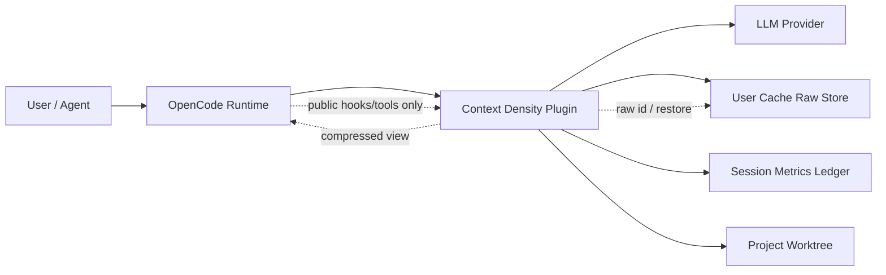
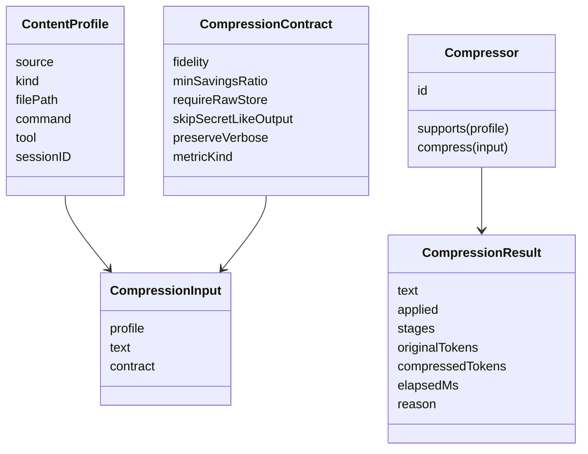
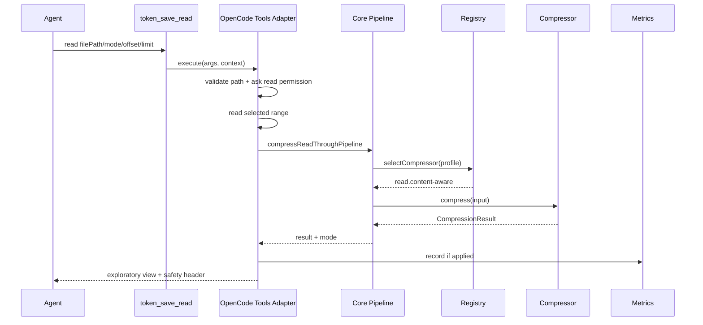
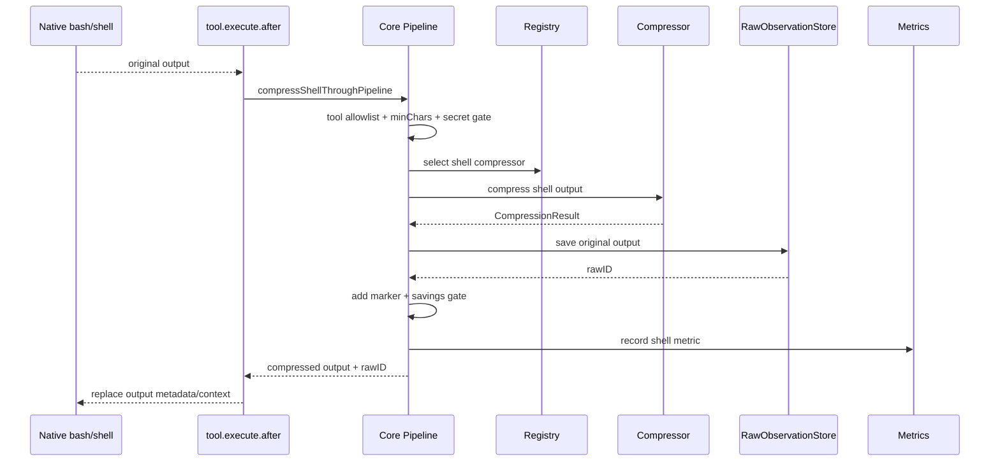
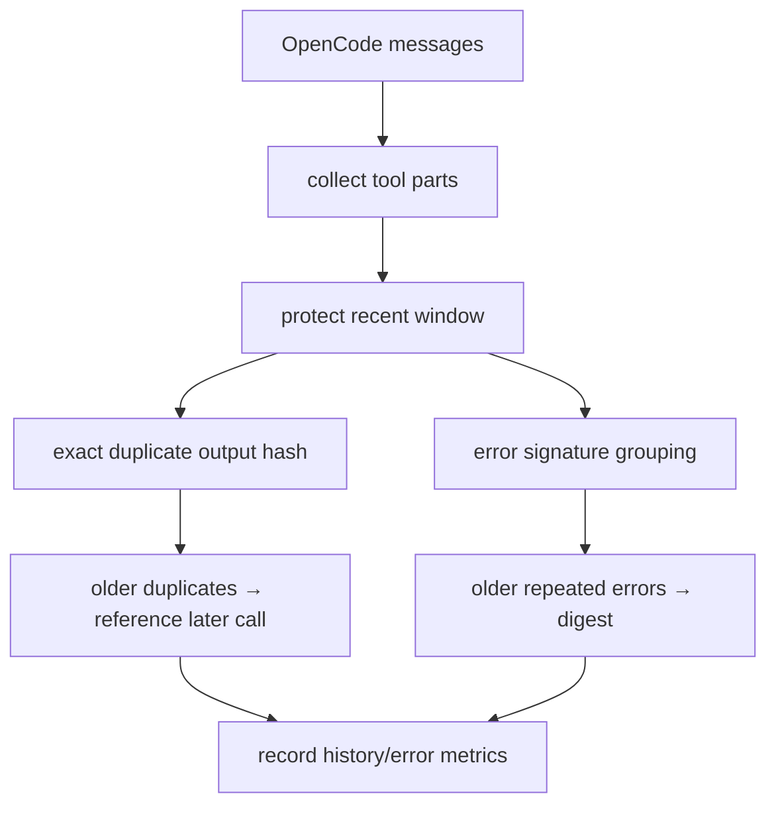

# OpenCode Context Density Plugin 架构书

日期：2026-07-07  
状态：Living Architecture Document  
版本：0.3

## 1. 摘要

本项目是一个不修改 OpenCode 源码的 Context 信息密度提升插件。它通过 OpenCode 公开 plugin hooks 和 custom tools，在 Context 注入边界对低密度信息进行压缩、去重、折叠和可恢复卸载，让主 Session 的上下文增长更慢。

架构选择：

```text
Thin OpenCode Adapter
  → Core Pipeline
    → Compressor Registry
      → Pure Compressors
```

核心原则：

1. OpenCode adapter 只处理运行时边界，不承载压缩算法；
2. Core pipeline 统一执行 safety gate、fidelity contract、savings gate、raw-store gate、metrics；
3. Compressor registry 让新增算法以注册方式接入；
4. 具体 compressor 尽量是纯函数，可独立测试与 benchmark；
5. 有损压缩默认可恢复，失败时 fail-open；
6. 原生 `read` 不透明压缩，探索读取和编辑读取分离。

## 2. 背景与问题

Agent 长任务中，Context 会被以下低密度对象持续占据：

- Read 工具读入的 license、长注释、视觉缩进、Markdown 表格对齐；
- Shell 输出中的 passed 测试、build progress、ANSI 动态进度、重复日志；
- JSON/XML/YAML 中重复 key、pretty whitespace、长同构数组；
- 历史消息中的重复工具输出、重复错误栈、已解决子任务；
- 工具 schema、agent prompt、skills/rules 等高频系统上下文；
- WebFetch/HTML 的导航、广告、脚本、样板 markdown。

这些内容单条无害，但累计会压缩真正决策信息的比例，导致模型更早触发 compaction，也更容易遗漏关键事实。

## 3. 架构目标

### 3.1 功能目标

- 支持 read/shell/history/compaction 四类 OpenCode 注入点；
- 支持 instruction、code、log、markdown、json、xml、shell、history 等内容类型；
- 对探索读取提供 `token_save_read`，对 raw 恢复提供 `context_raw`，对指标提供 `context_report`；
- 对 Shell 输出提供透明后处理；
- 对历史消息提供重复输出与重复错误压缩；
- 在 compaction 前注入保留规则与密度遥测。

### 3.2 质量目标

| 质量属性 | 目标 |
|---|---|
| 可理解性 | 新人按 `index → adapter → pipeline → registry → compressor` 阅读即可 |
| 可扩展性 | 新增算法不改 OpenCode hook 主流程，只注册 compressor |
| 正确性 | 强约束、错误、路径、行号、失败证据优先保留 |
| 安全性 | secret-like 内容不压缩、不落盘 |
| 可恢复性 | 有损 Shell 输出默认先写 raw store，再替换 Context |
| 性能 | 默认规则型 compressor p95 低于 20ms |
| 可测试性 | compressor/core/adapter 分层测试，benchmark 可复现 |
| 可移植性 | 不依赖 RTK 或外部压缩框架，重型算法未来作为可选 adapter |

## 4. 系统上下文



本插件不改 OpenCode 内核，不拦截 provider API，不修改持久化 session 原文；只在公开插件注入点生成发往模型前的视图。

## 5. 代码分层

```text
src/
  index.ts
  adapters/
    opencode/
      tools.ts
      hooks.ts
      permissions.ts
  core/
    context-object.ts
    ports.ts
    pipeline.ts
    registry.ts
  compressors/
    common.ts
    read.ts
    shell.ts
    structured.ts
    result.ts
  history.ts
  raw-store.ts
  metrics.ts
  config.ts
  token-estimator.ts
  api.ts
```

### 5.1 Composition Root

文件：`src/index.ts`

职责：

- 解析插件配置；
- 初始化 `MetricsLedger`；
- 初始化 `RawStore`；
- 创建 OpenCode tools；
- 创建 OpenCode hooks；
- 处理日志 fail-safe。

不应包含：

- 具体压缩算法；
- Shell/Read/History 的分类细节；
- raw marker 拼接细节；
- benchmark 或外部算法依赖。

### 5.2 OpenCode Adapter

文件：

- `src/adapters/opencode/tools.ts`
- `src/adapters/opencode/hooks.ts`
- `src/adapters/opencode/permissions.ts`

职责：

- 把 OpenCode 的 tool/hook 输入转成 core pipeline request；
- 处理 worktree path 校验和 read 权限询问；
- 包装 `token_save_read` 输出头；
- 把 pipeline 输出写回 OpenCode tool result；
- 将 OpenCode 事件映射到 metrics ledger。

OpenCode adapter 是唯一知道 `@opencode-ai/plugin` tool schema 和 hook shape 的层。

### 5.3 Core

文件：

- `src/core/context-object.ts`
- `src/core/ports.ts`
- `src/core/pipeline.ts`
- `src/core/registry.ts`

职责：

- 定义 `ContentProfile`、`CompressionContract`、`Compressor`；
- 通过 registry 选择 compressor；
- 执行 secret gate、raw store gate、savings gate；
- 统一 marker token 计费；
- 统一记录 metrics；
- 让 core 只依赖端口，不依赖具体 `RawStore` 或 `MetricsLedger`。

### 5.4 Compressors

文件：

- `src/compressors/common.ts`
- `src/compressors/read.ts`
- `src/compressors/shell.ts`
- `src/compressors/structured.ts`
- `src/history.ts`

职责：

- 只表达内容语义；
- 输入文本，输出 `CompressionResult`；
- 不直接读写 raw store；
- 不直接依赖 OpenCode runtime；
- 对不确定内容 fail-open。

### 5.5 Infrastructure Adapters

文件：

- `src/raw-store.ts`
- `src/metrics.ts`
- `src/token-estimator.ts`
- `src/config.ts`

职责：

- raw observation 的 session 隔离存取；
- session 级别 metrics 聚合与 report 格式化；
- provider-neutral token 估算；
- 插件配置默认值、合并与合法化。

## 6. 核心领域模型



## 7. 运行时流程

### 7.1 探索读取流程



设计点：

- native `read` 不被透明压缩；
- 输出 header 明确 `exploratory=true`；
- 修改前必须用 native `read` 回读精确范围。

### 7.2 Shell 输出压缩流程



设计点：

- secret-like 输出提前透传；
- raw store 写失败时默认取消有损替换；
- marker token 计入最终收益；
- verbose/debug/trace 默认跳过命令级有损折叠。

### 7.3 历史消息变换流程



设计点：

- 不修改 OpenCode 持久化历史，只改发往模型前的 view；
- 只压缩旧的、重复的、白名单工具输出；
- latest full error 留在 recent/protected window。

### 7.4 Compaction 增强流程

```text
experimental.session.compacting
  → read metrics snapshot
  → inject compaction preservation rules
  → preserve requirements / unresolved decisions / edit locations / failures / raw ids
```

## 8. 端口与适配器

文件：`src/core/ports.ts`

```ts
interface MetricsSink {
  record(sessionID, kind, record): void
}

interface RawObservationWriter {
  save(sessionID, text, metadata?): Promise<string | undefined>
}

interface LoggerPort {
  log(level, message, error?): Promise<void>
}
```

端口化收益：

- core pipeline 不依赖文件系统；
- benchmark 可注入 fake store/fake metrics；
- 未来支持 browser store、sqlite store、remote store 时不改 pipeline；
- OpenCode adapter 只负责把具体类适配成端口。

## 9. Compressor Registry

当前默认 registry：

| ID | 支持 profile | 实现 |
|---|---|---|
| `read.content-aware` | `source=read` | `compressReadContent` |
| `shell.command-aware` | `source=shell` | `compressShellOutput` |

新增 compressor 的约定：

```ts
const compressor: Compressor = {
  id: "json.schema-rows",
  supports(profile) {
    return profile.source === "read" && profile.kind === "json"
  },
  compress(input) {
    return compressJsonContent(input.text, input.contract.minSavingsRatio, true)
  },
}
```

每个 compressor 必须声明或通过测试证明：

- 支持的 `ContentProfile`；
- fidelity 级别；
- 是否有损；
- 保护事实；
- skip 条件；
- benchmark fixture；
- fail-open 行为。

## 10. 已实现压缩算法

| 场景 | 算法 | 保真级别 |
|---|---|---|
| Instruction Markdown | frontmatter 保留、注释省略、表格视觉行省略、exact rule dedup | edit-safe |
| Code | license header 省略、长 JSDoc 折叠、非 Python 长函数体折叠、缩进归一 | exploratory |
| Logs | ANSI strip、template runs、timestamp prefix fold、duplicate line fold | edit-safe/exploratory |
| Markdown | 注释省略、表格分隔行省略、表格空白压缩、空行折叠 | exploratory |
| JSON | parse + canonicalize、homogeneous array schema+rows | exact/exploratory |
| XML | comment omit、inter-tag whitespace fold、whitespace-sensitive fail-open | exploratory |
| Shell test | passed lines fold、failure/details/summary 保留 | edit-safe |
| Shell build | build progress fold、error/warning/file line 保留 | edit-safe |
| Progress bars | carriage-return final frame | edit-safe |
| Stack traces | external frames fold、project frames 保留 | edit-safe |
| History duplicate output | normalized hash exact dedup | summary |
| Repeated errors | signature digest + project frames + external count | summary |

## 11. 安全不变量

1. Native `read` 永不透明压缩；
2. `token_save_read` 输出不能作为编辑唯一依据；
3. secret-like 内容不压缩、不落 raw store；
4. Shell 有损压缩默认必须先保存 raw observation；
5. marker/header token 计入 savings gate；
6. JSON exact canonicalization 必须可 parse round-trip；
7. XML 遇到 DTD、entity、CDATA、mixed content、`xml:space=preserve` 时 fail-open；
8. 最近工具输出窗口受保护；
9. 错误压缩必须保留 latest full error；
10. 所有 compressor 抛错都必须 fail-open。

## 12. 测试架构

```text
tests/
  core/pipeline.test.ts     # core ports, registry, fail-open, raw gate
  plugin.test.ts            # OpenCode hooks/tools integration
  entrypoint.test.ts        # root export safety and api subpath
  read.test.ts              # read compressors
  shell.test.ts             # shell compressors
  structured.test.ts        # json/xml/instruction
  history.test.ts           # history transform
  raw-store.test.ts         # raw store isolation
  metrics.test.ts           # metrics ledger
```

测试分层：

| 层 | 测试目标 |
|---|---|
| Compressor unit | 给定输入输出，保护关键事实 |
| Core pipeline | registry、ports、raw gate、secret gate、metrics |
| Adapter integration | OpenCode tool/hook shape、permission、metadata |
| Package entrypoint | 根入口只导出 plugin，API 子路径导出 pure/core |
| Benchmark | token saving、critical recall、latency、context persistence |
| OpenCode smoke | 真实 OpenCode 加载插件并调用工具 |

## 13. Benchmark 架构

文件：

- `benchmark/run.ts`
- `benchmark/opencode-smoke.ts`
- `benchmark/opencode-ab.ts`

指标：

- raw tokens；
- compressed tokens；
- saved percent；
- critical recall；
- p50/p95 latency；
- turns before 128k context fills；
- persistence multiplier；
- real provider usage in A/B；
- OpenCode plugin load success。

原则：

- deterministic corpus 保护 compressor 质量；
- real A/B 证明实际 OpenCode/provider usage；
- token 估算和 provider usage 明确区分；
- benchmark 不为追求 token saving 牺牲 critical recall。

## 14. 扩展路径

### 14.1 新增内容类型

1. 在 `ContentKind` 中增加类型；
2. 增加 classifier；
3. 实现 pure compressor；
4. 注册到 registry；
5. 增加 unit test；
6. 增加 benchmark fixture；
7. 更新 scenario matrix 和 README。

### 14.2 新增 Shell 命令压缩

1. 明确命令 grammar；
2. 明确保留字段：failure、warning、summary、file:line、exit status；
3. 实现 command-aware stage；
4. verbose/debug/trace fail-open；
5. raw store gate 不绕过；
6. 增加非零退出、unknown format、secret-like fixture。

### 14.3 接入重型算法

Tree-sitter、LLMLingua、OCR、PDF parser 等必须作为可选 adapter：

- 未安装时不影响核心功能；
- 有 timeout；
- 输出走同一 safety/savings/raw/metrics gate；
- benchmark 单独报告延迟；
- 默认不用于强约束指令、代码编辑路径和结构化 exact 模式。

## 15. 配置模型

文件：`src/config.ts`

主要配置：

| 配置段 | 作用 |
|---|---|
| `shell` | 是否启用 shell 压缩、工具白名单、最小字符数、收益阈值、verbose 策略 |
| `read` | 最大读取字节、默认行数、收益阈值 |
| `history` | 是否启用历史压缩、最小字符数、recent window、白名单工具 |
| `rawStore` | 是否启用、目录、session 容量、TTL |
| `security` | 是否跳过 secret-like 输出 |
| `compaction` | 是否注入 compaction 规则 |

配置合并必须合法化：

- ratio clamp；
- positive/non-negative number；
- tool list 去重；
- 无效配置回退默认值。

## 16. 数据与状态

### 16.1 Raw Store

Raw store 存储：

- 原始 shell output；
- metadata：tool、command；
- session 隔离 id；
- TTL 与容量限制。

不存储：

- secret-like 输出；
- 不需要恢复的 read exploratory view；
- OpenCode 持久化历史副本。

### 16.2 Metrics Ledger

Metrics 按 session 聚合：

- calls；
- original/compressed chars；
- original/compressed estimated tokens；
- saved tokens；
- latency；
- stages；
- compaction count；
- by kind 统计。

## 17. 错误处理与降级

| 错误 | 行为 |
|---|---|
| compressor 抛错 | `runRegisteredCompressor` fail-open，返回原文 |
| raw store 初始化失败 | 记录 warn；有损 shell 替换时仍要求可恢复，否则透传 |
| raw store save 失败 | shell 输出保持原文 |
| secret-like output | 不压缩、不保存 |
| low savings | 保持原文 |
| parser 失败 | 保持原文或保守 lexical |
| OpenCode log 失败 | 忽略，不影响 Agent |
| 外部工具不可用 | 跳过 optional compressor |

## 18. 当前限制

- 代码压缩仍是 lexical + brace matching，不是 Tree-sitter AST；
- `history.ts` 还在 `src/` 顶层，后续可迁入 `compressors/history`；
- read registry 目前以 `read.content-aware` 聚合多种 read mode，后续可拆为更细 compressor id；
- benchmark 尚未按 compressor id 聚合；
- prompt cache read/write 只在 A/B runner 中记录，尚未做长期趋势报告；
- WebFetch/HTML compressor 尚未实现。

## 19. 演进路线

### Phase 1：架构稳定化（当前）

- 薄 OpenCode adapter；
- core pipeline；
- ports；
- registry；
- deterministic compressor；
- raw store；
- metrics。

### Phase 2：Compressor 细分

- `read.code-lexical`
- `read.instruction-dedup`
- `read.json-schema-rows`
- `read.xml-conservative`
- `shell.test-pass-fold`
- `shell.build-progress-fold`
- `shell.log-template-fold`
- `history.duplicate-output`
- `history.repeated-error-digest`

### Phase 3：高级文档类型

- HTML main-content extraction；
- JSONL/NDJSON schema+rows；
- YAML config compressor；
- lockfile summary；
- CI config compressor；
- coverage/lint/typecheck dedicated compressor。

### Phase 4：可选重型能力

- Tree-sitter code skeleton；
- LSP symbol graph；
- repo map graph ranking；
- learned natural-language compression；
- PDF/Docx/Notebook extraction adapters。

### Phase 5：评测平台化

- benchmark 按 compressor id 聚合；
- cache read/write 趋势；
- multi-run confidence interval；
- coding task A/B；
- regression dashboard。

## 20. 代码阅读指南

推荐顺序：

1. `src/index.ts`：看插件如何组合；
2. `src/adapters/opencode/tools.ts`：看自定义工具；
3. `src/adapters/opencode/hooks.ts`：看 OpenCode hooks；
4. `src/core/context-object.ts`：看领域对象；
5. `src/core/ports.ts`：看端口；
6. `src/core/pipeline.ts`：看横切 gate；
7. `src/core/registry.ts`：看 compressor 选择；
8. `src/compressors/*.ts`：看具体算法；
9. `src/history.ts`：看历史压缩；
10. `tests/core/pipeline.test.ts`：看架构不变量如何被测试保护。

## 21. 架构验收清单

- [x] `src/index.ts` 不包含具体压缩算法；
- [x] core pipeline 不依赖 OpenCode runtime；
- [x] core pipeline 通过 ports 依赖 metrics/raw/log；
- [x] compressor 可不启动 OpenCode 单独测试；
- [x] 有损 Shell 输出先 raw store 再替换；
- [x] secret-like 输出不落盘；
- [x] root entrypoint 只导出 plugin runtime function；
- [x] pure/core API 从 `/api` 子路径导出；
- [x] benchmark 覆盖 token saving、critical recall、latency；
- [x] OpenCode smoke 覆盖真实插件加载。
